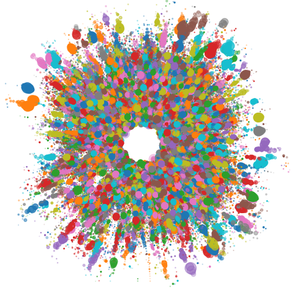

## Pattern recognition for particle shower reconstruction

Master's thesis at University of Zurich focused on particle shower reconstruction at the CMS HGCAL.
Towards scalable pattern recognition on the point cloud of clusters.

### Problem

Connect clusters of energy generated by the same particle.

### Approach

Explore graph based methods such as ParticleNet.

### Color scheme

Color palette for thesis figures:
- orange: #E69F00
- lightblue: #56B4E9
- green: #009E73
- yellow: #F0E442
- darkblue: #0072B2
- darkorange: #D55E00
- pink: #CC79A7